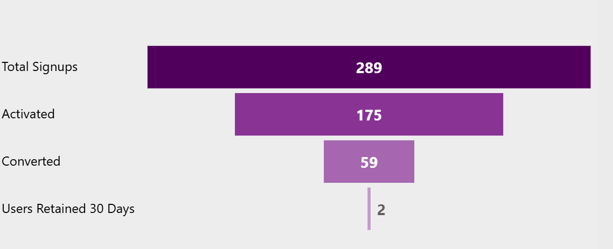

# Freemium Conversion Funnel — SQL Analytics

A complete SQL-driven analysis of a freemium product’s user journey.  
This project models the conversion funnel (**Signup → Activation → Conversion → 30-Day Retention**), calculates core product KPIs, and uncovers actionable insights that power a companion Power BI dashboard.

---

## Companion Power BI Project
🔗 https://github.com/SHREYA-TK/Freemium-Conversion-Funnel--Power-BI-Dashboard

**Note**  
Feedback insights are **not included** in this SQL analysis because the SQL dataset does not contain user ratings or feedback fields.  
Those insights are explored exclusively in the Power BI project, which uses an additional feedback table imported directly into Power BI.

---

## 1. Project Overview

Freemium products depend heavily on smooth user progression from signup to long-term retention.  
This project focuses on understanding funnel health, identifying where users drop off, and comparing regional performance using SQL as the analytical truth layer.

SQL outputs from this project are later used by Power BI to create visual storytelling.

---

## 2. Dataset Description

The dataset represents user-level activity for a freemium digital product and includes:
- User signups
- Activation status
- Conversion events
- Retention indicators
- Geographic region

Each row represents a unique user and their journey stage within the product lifecycle.

---

## 3. Key Business Questions

This analysis was designed to answer the following product questions:

- Where do users drop off in the conversion funnel?
- How effective is user activation at driving conversion?
- Which regions perform better or worse across the funnel stages?
- Where should product teams focus optimisation efforts?

---
## 4. Funnel Performance Breakdown


### 4.1 Signups → Activation (289 → 175)

A strong number of users sign up, but almost 40% never activate.
This indicates friction in onboarding or unclear early value.

### 4.2 Activation → Conversion (175 → 59)

Only one-third of activated users convert.
This suggests premium value is not being communicated strongly enough during the free experience.

### 4.3 Conversion → 30-Day Retention (59 → 2)

The steepest drop occurs after conversion.
Even paying users do not remain engaged long-term, highlighting weak habit formation.


## 5. Key KPIs 

| Metric | Value |
| --- | ---: |
| Total signups | 289 |
| Activated users | 175 |
| Converted users | 59 |
| Retained 30 days | 2 |
| Activation rate | 60.6% |
| Conversion rate (activated → converted) | 33.7% |
| Overall conversion | 20.4% |
| 30-day retention | 0.69% |
| Churn | 99.7% |
| Avg days to convert | 7.90 |

---
## 6. SQL Analysis

### 6.1 Funnel Performance Analysis

The funnel analysis quantifies how many users progress through each stage of the product journey.  
This helps identify friction points that prevent users from reaching conversion or long-term retention.

#### SQL Query
```sql
SELECT
    COUNT(*) AS total_signups,
    SUM(CASE WHEN activated = TRUE THEN 1 ELSE 0 END) AS activated_users,
    SUM(CASE WHEN converted = TRUE THEN 1 ELSE 0 END) AS converted_users,
    SUM(CASE WHEN retained_30_days = TRUE THEN 1 ELSE 0 END) AS retained_30_days
FROM users;
```

#### Insight

While the product attracts a healthy number of signups, a significant drop occurs between activation and conversion.  
This indicates that onboarding alone is not sufficient to drive monetisation.  
The most severe drop-off is observed at the retention stage, suggesting weak habit formation or insufficient post-conversion engagement mechanisms.

---

### 6.2 Regional Performance Analysis

Regional analysis compares user behaviour across different geographies to uncover market-level opportunities and weaknesses.

#### SQL Query
```sql
SELECT
    region,
    COUNT(*) AS total_users,
    SUM(CASE WHEN activated = TRUE THEN 1 ELSE 0 END) AS activated_users,
    SUM(CASE WHEN converted = TRUE THEN 1 ELSE 0 END) AS converted_users
FROM users
GROUP BY region
ORDER BY converted_users DESC;
```

#### Insight 

Some regions generate high signup volume but underperform in conversion, indicating a mismatch between acquisition messaging and product value perception.  
Other regions convert fewer users overall but demonstrate stronger conversion efficiency, making them ideal candidates for targeted growth investment or feature localisation.

---

## 7. Key Insights and Recommendations from Analysis

**Funnel Insights**  
Activation significantly improves conversion likelihood, yet it does not guarantee long-term retention.  
This highlights the need for stronger post-activation nudges, habit-building features, and value reinforcement early in the user lifecycle.

**Regional Insights**  
Regional discrepancies suggest that user behaviour is influenced by market-specific expectations.  
Optimising onboarding flows, pricing strategies, or feature emphasis by region could materially improve overall conversion performance.

---

## 8. Limitations & Scope

- Feedback and satisfaction metrics were not available in the SQL dataset.
- Retention analysis is limited to a 30-day window.
- Behavioural context (session depth, feature usage) is outside the scope of this SQL analysis.

These gaps are intentionally addressed in the Power BI dashboard using additional data sources.

---

## 9. Conclusion

This project demonstrates how SQL can be used as a foundational analytics layer to drive product decision-making.  
By translating raw user data into structured funnel and regional insights, the analysis highlights where growth is constrained and where optimisation efforts should be prioritised.

The outputs of this project directly feed into the companion Power BI dashboard, where stakeholders can explore trends visually and monitor KPIs at scale.  
Together, both projects showcase an end-to-end analytics workflow—from raw data to executive insight.

### 9.1. What I Learned

- Designing funnel KPIs in SQL.
- Analysing user behaviour stage by stage.
- Applying regional segmentation.
- Preparing SQL outputs for BI tools.


## 10. Repository Structure

```text
.
├── README.md
├── sql/
│   └── SQL_Queries.sql
├── images/
     └── funnel.png
```

---

## 9. How to Run

1. Load the dataset into PostgreSQL.
2. Query the `conversion_funnel_enriched` table.
3. Run the SQL analysis queries.
4. Export results to Power BI.

---

## 10. Related Project

➡️ **Power BI Dashboard (Visual Analytics & Feedback Insights)**  
https://github.com/SHREYA-TK/Freemium-Conversion-Funnel--Power-BI-Dashboard
